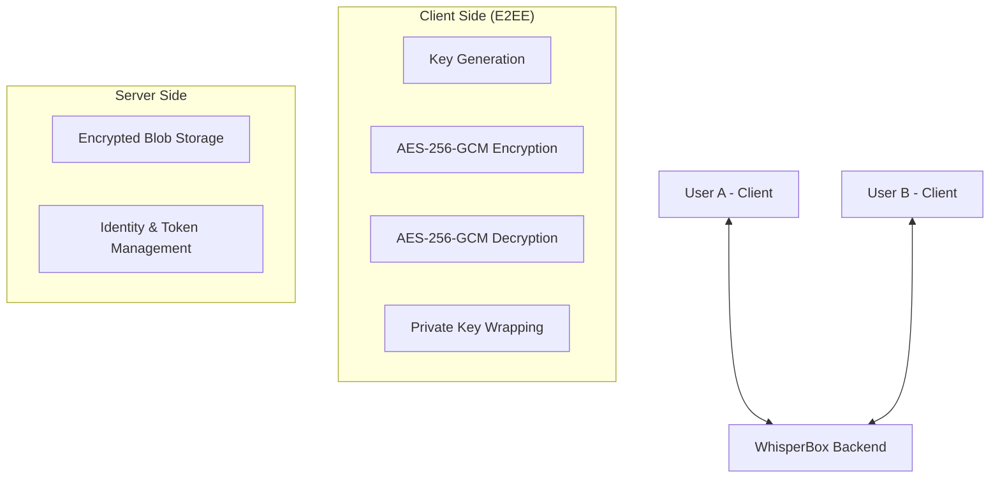

# WhisperBox — End-to-End Encrypted Messaging

WhisperBox is a premium, high-security messaging application that implements true End-to-End Encryption (E2EE). The server only handles encrypted blobs; all cryptographic operations occur exclusively on the user's device.

## 🏗️ Architecture

## 🔐 Encryption Flow

WhisperBox uses a **Hybrid Encryption** scheme combining asymmetric (RSA) and symmetric (AES) cryptography.

### 1. Registration & Key Setup
- The client generates a **2048-bit RSA-OAEP** keypair.
- A **128-bit PBKDF2 salt** is generated.
- A wrapping key is derived from the user's password using **PBKDF2 (100,000 iterations)**.
- The RSA private key is wrapped (encrypted) using **AES-256-GCM** (with a prepended 12-byte IV) and sent to the server.
- The RSA public key is sent to the server in plaintext for other users to fetch.

### 2. Sending a Message
1. **Fetch Public Key**: The sender fetches the recipient's RSA public key from the server.
2. **Symmetric Encryption**: A random **256-bit AES-GCM key** and **96-bit IV** are generated. The plaintext is encrypted with this key.
3. **Asymmetric Encryption**: 
    - The AES key is encrypted with the **recipient's** RSA public key.
    - The AES key is also encrypted with the **sender's** RSA public key (allowing the sender to read their own sent messages on other devices).
4. **Transmission**: The encrypted ciphertext, IV, and both encrypted keys are sent to the backend.

### 3. Receiving a Message
1. The recipient receives the encrypted payload.
2. The recipient uses their **RSA private key** to decrypt the AES-GCM key.
3. The recipient uses the AES-GCM key + IV to decrypt the ciphertext into plaintext.

## 🔑 Key Management
- **Public Keys**: Stored on the server and accessible to all registered users.
- **Private Keys**: Stored on the server **only in wrapped (encrypted) form**. They can only be decrypted using the user's password, which never leaves the client.
- **Session Security**: Once unwrapped, the private key is held in memory for the duration of the session and never written to `localStorage`.

## ⚖️ Security Trade-offs
- **Password Strength**: Since the private key is wrapped with a password-derived key, the security of the E2EE relies heavily on the user's password strength.
- **No Password Recovery**: If a user forgets their password, their private key cannot be unwrapped, and all previous messages become permanently unreadable.
- **Client-Side Trust**: The system assumes the client device is not compromised.

## ⚠️ Known Limitations
- **Forward Secrecy**: The current implementation uses a static RSA keypair. Compromise of the private key would allow decryption of all past messages if the attacker had stored the ciphertexts.
- **Metadata**: While message content is encrypted, the server still knows who is talking to whom and when (traffic analysis).
- **Device Sync**: To log in on a new device, the user must provide their password to unwrap the private key fetched from the server.
